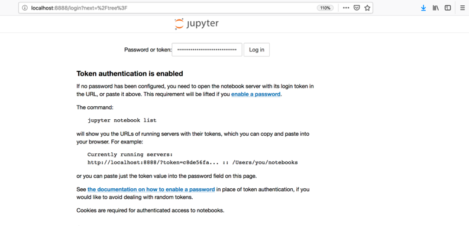
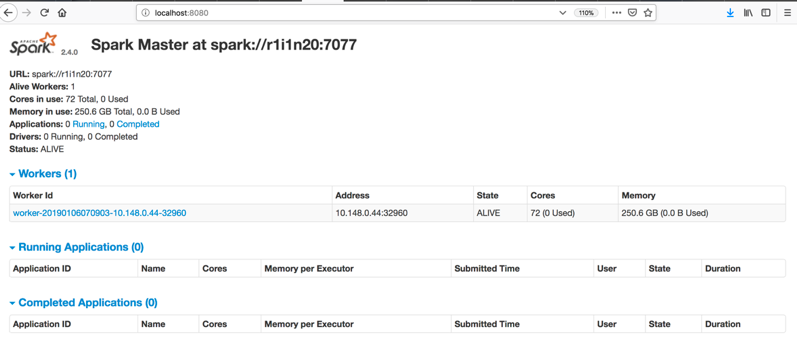
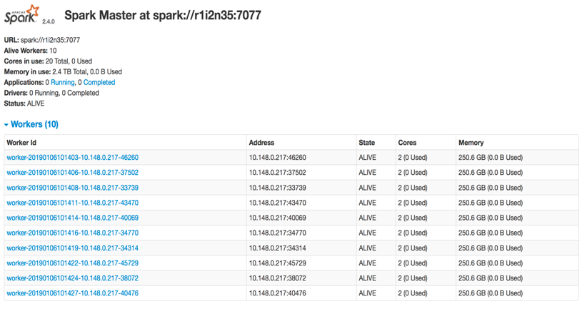
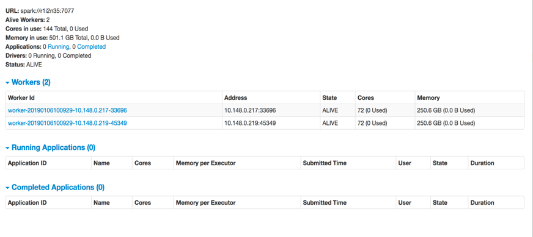

# Get Started with PySpark and Jupyter Notebooks on Cirrus

Jupyter Notebook is a popular application that enables you to edit, run and share Python code into a web view. 
It allows you to modify and re-execute parts of your code in a very flexible way. 
That's why Jupyter is a great tool to test and prototype programs. 
We are going to use Jupyter Notebooks for running our walkthroughs and lab exercises.
But first we need to do some steps for:
 * Copying all the material necessaire in our accounts in Cirrus 
 * Starting an interactive session in a node
 * Starting a spark cluster in that node
 * Starting a Jupyter session connected with pyspark

## Retrieving all the material: 

1. Open a new terminal and login into Cirrus: (replace USER by your username on Cirrus)
    ```
    ssh USER@login.cirrus.ac.uk
    ```

2. Copy the spark source and the other necessaries scripts into your `$HOME` directory:
    ```
    cp /lustre/home/shared/y15/spark/spark-2.4.0-bin-hadoop2.7.tar $HOME/.
    cp /lustre/home/shared/y15/spark/start_interactive.sh $HOME/.
    cp /lustre/home/shared/y15/spark/start_spark.sh  $HOME/.
    cp /lustre/home/shared/y15/spark/stop_spark.sh $HOME/.
    ```

3.	Decompress spark-2.4.0-bin-hadoop2.7.tar
    ```
    tar -zxvf spark-2.4.0-bin-hadoop2.7.tar
    ```
    
4.	Clone the repository in your `$HOME`:
    ```
    git clone https://github.com/EPCCed/prace-spark-for-data-scientists.git
    ```

## Starting an interactive session:

5. Start an interactive session in a node, using the `start_interactive` script. 
   This script requests by default one node from the y15 reservation for five hours.
   The reservation numbers are:
   
    * Day 1: R1170764
    * Day 2: R1170765

   Run `./start_interactive.sh R1170764` with your reservation number (in this example R1170764).
   
   If you want to change the time of your interactive session, modify the script by changing the walltime.

    ```
     #!/bin/bash --login
     qsub -IVl select=1:ncpus=36,walltime=05:00:00,place=scatter:excl -A y15 -j oe -q $1
    ```
   
   This will give you an interactive session into a node (e.g. node r1i1n20) and you will see something like this:
    
   ```
   [USERNAME@cirrus-login0 ~]$ ./start_interactive.sh R1197436
   qsub: waiting for job 399686.indy2-login0 to start
   qsub: job 399686.indy2-login0 ready
   [USERNAME@r1i1n20 ~]$
   ```
   You will need the name of the node assigned in the step 8.

**Note:** On the login node, the command `qstat -u $USER` gives you the number of nodes and cores allocated for your interactive job.


## Starting a Spark cluster: 

6. Start the spark cluster in the node assigned to us (e.g. r1i1n20) using the `start_spark` script. 
    It is very important to use source to export the environment variables into your PATH. 
    By default, this script starts one master process and one worker process on the same node 
    (it also starts the history server). The worker process runs one worker instance by default, 
    which is configured to use all available CPUs.
    
    ```
    [USERNAME@r1i1n20 ~]$ source ./start_spark.sh 
    1 node(s) assigned
    Autoloading gcc/6.2.0
    starting org.apache.spark.deploy.master.Master, logging to /lustre/home/y15/USERNAME/spark-2.4.0-bin-hadoop2.7/logs/spark-USERNAME-org.apache.spark.deploy.master.Master-1-r1i1n20.out
    failed to launch: nice -n 0 /lustre/home/y15/USERNAME/spark-2.4.0-bin-hadoop2.7/bin/spark-class org.apache.spark.deploy.master.Master --host r1i1n20 --port 7077 --webui-port 8080
    full log in /lustre/home/y15/USERNAME/spark-2.4.0-bin-hadoop2.7/logs/spark-USERNAME-org.apache.spark.deploy.master.Master-1-r1i1n20.out
    r1i1n20: Warning: Permanently added 'r1i1n20,10.148.0.44' (ECDSA) to the list of known hosts.
    r1i1n20: starting org.apache.spark.deploy.worker.Worker, logging to /lustre/home/y15/USERNAME/spark-2.4.0-bin-hadoop2.7/logs/spark-USERNAME-org.apache.spark.deploy.worker.Worker-1-r1i1n20.out
    starting org.apache.spark.deploy.history.HistoryServer, logging to /lustre/home/y15/USERNAME/spark-2.4.0-bin-hadoop2.7/logs/spark-USERNAME-org.apache.spark.deploy.history.HistoryServer-1-r1i1n20.out
    ```

**Note 1:** We can also configure the number of worker instances launched by each worker and
the number of CPUs bound to each worker.
This is done by passing arguments to the `setup_spark_env.py` script called from within `start_spark.sh`,
see below for the actual command.
```
python $SPARK_CONF_DIR/setup_spark_env.py "SPARK_WORKER_INSTANCES=10" "SPARK_WORKER_CORES=2"
```

**Note 2:** To shutdown spark and close the interactive session, simply run “./stop_spark.sh” followed by “exit”.
```
[USERNAME@r1i1n20 ~]$./stop_spark.sh
stopping org.apache.spark.deploy.master.Master
stopping org.apache.spark.deploy.history.HistoryServer
r1i1n20: stopping org.apache.spark.deploy.worker.Worker 
[USERNAME@r1i1n20 ~]$ exit
```
## Starting a Jupyter session connected with Pyspark: 
7. Start the jupyter server:  
   1. Run `start_Jupyter_local.sh` with your MASTER node as an argument
   (which is the node assigned to us in the interactive session, e.g. r1i1n20)  
   1. Then run the script:
      ```
      ./start_Jupyter_local.sh r1i1n20
      ```
      This will give you a token, which will be used in step 8, 
      like this one: http://0.0.0.0:8888/?token=2d5e554b2397355c334b8c3367503b06c4f6f95a26151795  

8. Open another terminal and type the following command but replacing USER by your username on Cirrus, 
   and MASTER NODE by the node that has been assigned to you in the interactive session (e.g. r1i1n20). 
   ```
   ssh USER@login.cirrus.ac.uk -L8888:MASTER_NODE:8888
   ```
   In a web browser open http://localhost:8888/ -
   this will start a Jupyter session, where you will have to type the token 
   (only the first time) given to you in the step 7. 
   

## Monitoring Spark

9. Finally, Spark can be monitored via the master node's web UI. 
   1. Simply launch another terminal session and run something like
   ```
   ssh USER@login.cirrus.ac.uk -L8080:MASTER_NODE:8080
   ```
   2. Point your web browser to http://localhost:8080/

   In this page we can see the details of the configuration of our spark cluster, 
   depending on the configuration used in start_interactive (number of nodes), 
   start_spark (number of workers, and number of cores per worker) scripts. 
 
    ### Example 1:
    Using the default values in both the scripts:
    **the master and a worker process** are located in the **same node** 
    and the worker process is configured with 72 cores.
    

    ### Example 2:
    We have asked for one node (in start_interactive), but we have configured the spark cluster 
    (start_spark) to have 10 workers with 2 cores per worker. 
    ```
    python $SPARK_CONF_DIR/setup_spark_env.py "SPARK_WORKER_INSTANCES=10" "SPARK_WORKER_CORES=2"
    ```
    
    
    ### Example 3:
    We have asked for two nodes (in start_interactive), 
    but we have configured the spark cluster (start_spark) to have a worker per node, 
    using all cores available per worker (72).
    
    
10. Every SparkContext launches a web UI (Spark driver’s web UI), by default on port 4040, 
    that displays useful information (jobs, stages, storage for RDD persistence, broadcasts, accumulators) 
    about the application. 
    Remember that in since we are using PySpark, it automatically creates the SparkContext for us. 
    
    1. After running a notebook, you could check the following web UI, by launching in another terminal: 
       ```
       ssh USER@login.cirrus.ac.uk -L4040:MASTER NODE:4040
       ```
    1. Point your web browser to http://localhost:4040

    The Spark driver's web UI purpose is to show the progress of your computations, 
    while the standalone Master's web UI is to let you know the current state of your 
    "operating environment" (aka the setup and status of the Spark standalone cluster).
    

**Note:** You can use a single command to tunnel all the ports for the Spark UI
```
ssh -L8888: MASTER NODE:8888 -L8080: MASTER_NODE:8080 -L4040: MASTER NODE:4040 USER@login.cirrus.ac.uk
```

